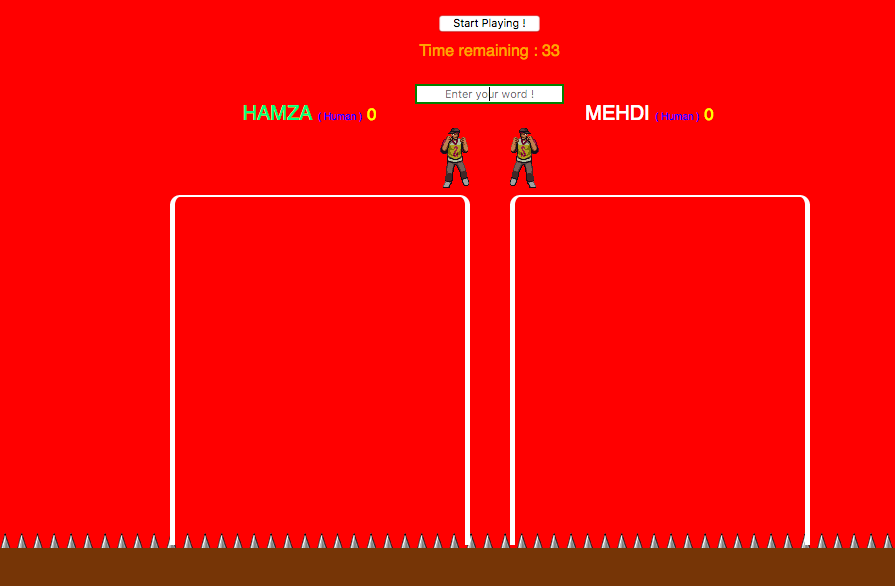

This a simple game that I'm making to learn the basic concepts of REACT JS.
Two players fight using words. Each word is assigned a number of points depending on the length and complexity oTwo players fight using words. Each word is assigned a number of points depending on its length and complexity. The other player is then pushed backward by a distance proportional to the points assigned to the word.

The first player to fall off the cliff loses.

 
